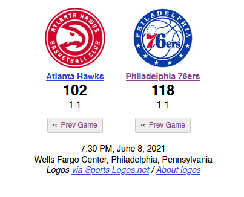

# NBA Final Score Prediction
Predicts final score of an NBA game based on first quarter statistcs with MLP regression.

### DESCRIPTION
To begin, 

Using MLP regression from the scikit learn neural network, 

### DEMO
Lets test the recent game 2 of the Eastern Conference Semi-finals: Atlanta Hawks @ Philadelphia 76ers. After entering the first quarter stats 
and regular season wins from each team, we get a prediction of 115-104, not too far off of the actual final score 118-102.

